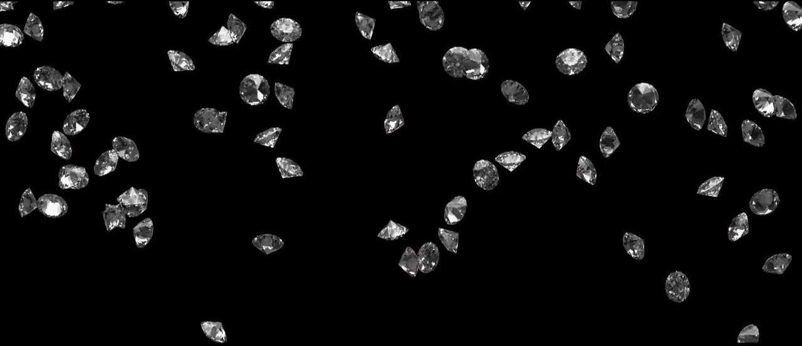
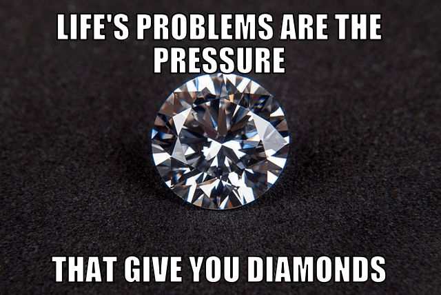

## Kaggle Competition

The goal of this competition is the prediction of the price of diamonds based on their characteristics (weight, color, quality of cut, etc.), putting into practice machine learning techniques.

## Dataset 💎

Column name   | Description
------------- | -------------
id | id for prediction sample identification 
price | price in USD
carat | weight of the diamond
cut | quality of the cut (Fair, Good, Very Good, Premium, Ideal)
color | diamond colour, from J (worst) to D (best)
clarity | a measurement of how clear the diamond is (I1 (worst), SI2, SI1, VS2, VS1, VVS2, VVS1, IF (best))
x | length in mm
y | width in mm
z | depth in mm
depth | total depth percentage = z / mean(x, y) = 2 * z / (x + y) 
table | width of top of diamond relative to widest point 

## Evaluation Metric 

The evaluation metric chosen for this competition is the RMSE (Root Mean Squared Error)

## Define Problem 

We are handling with a **REGRESSION** problem, as the outcome is to predict diamond's prices. This is not a classification problem for clasifying different classes.

## Resolution process

#### 🧹 Clean dataset

- Conversion of categorial columns to numerical columns for applying the regression algorithm. 

- Drop columns with high correlation features (`x`, `y`, `z`)

#### 👩🏼‍💻 Train possible models

Model          |   r2  |   RMSE    | 
-------------- | ----- | --------- | 
Linear Regression |  0.9068 | 1199.1478 |
Decission Tree | 0.962 | 765.2389  |
Gradient Boosting | 0.9754 | 615.6342 |
Random forest |0.9802 |  552.5046 |

#### ✨ Grid search of best parameters

- Gradient Boosting 

